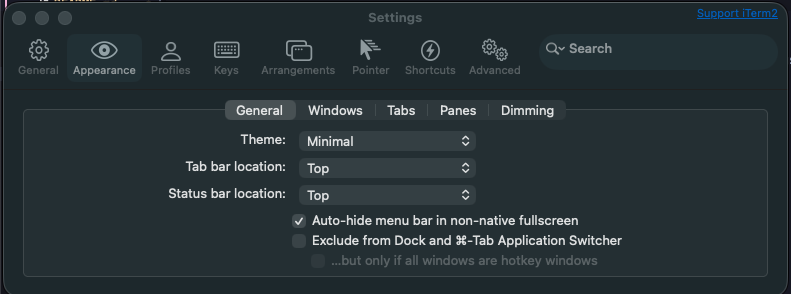
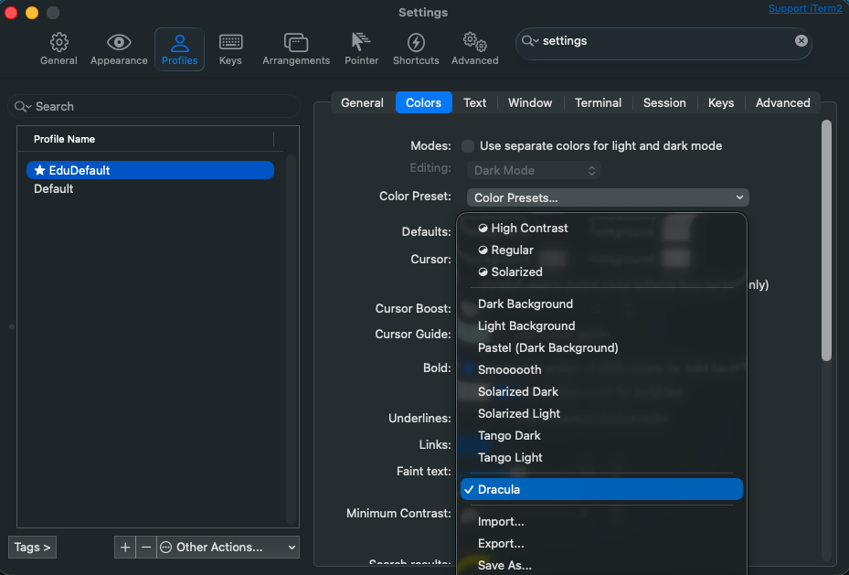
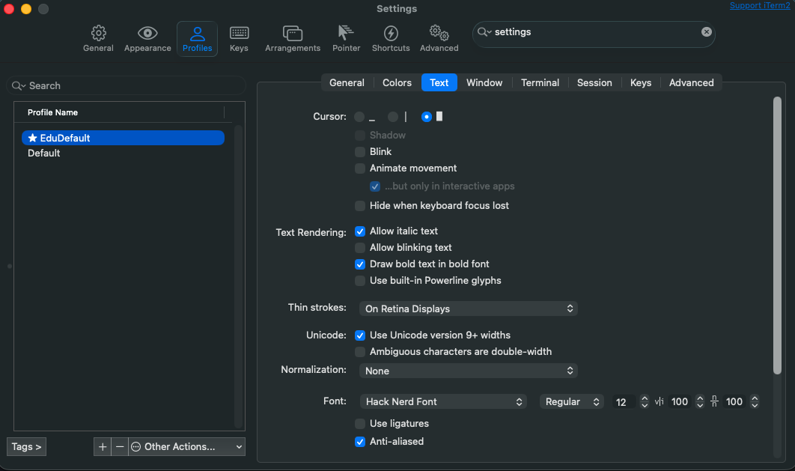
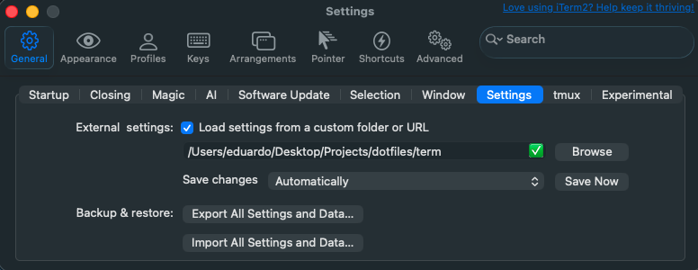

# eduardinni/dotfiles

Custom configuration for my dev env, includes zsh and iTerm configs.

# Installation

- Install Homebrew
- `brew install neovim`
- `brew install tmux`
- `npm install -g @kitlangton/ghui`

### zsh config

```bash
echo '\nsource /Users/eduardo/projects/dotfiles/bash/zshrc' >> ~/.zshrc
```

### tmux config

```bash
mkdir ~/.config/tmux

ln -s $EDU_DOTFILES/tmux/tmux.conf ~/.config/tmux/tmux.conf
```

# tmux keymap

## Prefix
| Key | Action |
|-----|--------|
| `C-s` | Primary prefix (default) |
| `C-b` | Secondary prefix |

## General
| Key | Action |
|-----|--------|
| `q` | Reload config |

## Pane Controls
| Key | Action |
|-----|--------|
| `h` | Split pane vertically |
| `v` | Split pane horizontally |
| `x` | Kill current pane |

## Window Controls
| Key | Action |
|-----|--------|
| `c` | New window |
| `r` | Rename window |
| `k` | Kill window |

## Copy Mode (Vi)
| Key | Action |
|-----|--------|
| `v` | Begin selection |
| `y` | Copy selection |

- Enter copy mode (`Ctrl+b [`)
- Move with `h j k l`
- `v` → select
- `y` → yank (copy) and quit
- `q` → exit copy mode

# iTerm





